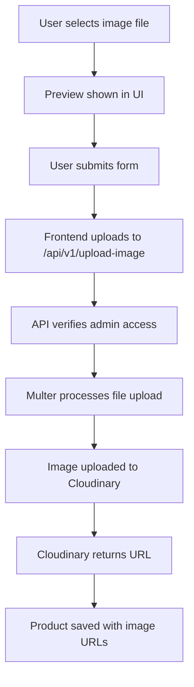

# Cloudinary Image Upload Setup Guide

## Overview

The Shunapee Fashion House Fashion admin panel now supports direct image uploads to Cloudinary for product management. This replaces the previous URL-based image input with a proper file upload system.

## Features

- ✅ Direct image upload to Cloudinary from admin panel
- ✅ Image preview before upload
- ✅ Automatic image optimization (max 1000x1000px, auto quality)
- ✅ 5MB file size limit per image
- ✅ Support for editing products (keeps existing images if not changed)
- ✅ Admin-only access with authentication middleware
- ✅ File type validation (images only)

## Prerequisites

1. **Cloudinary Account**
   - Sign up at https://cloudinary.com (free tier available)
   - Get your Cloud Name, API Key, and API Secret from the dashboard

## Installation

### 1. Packages Installed
```bash
npm install cloudinary multer
npm install --save-dev @types/multer
```

### 2. Environment Variables

Add the following to both `.env` and `.env.local`:

```bash
# Cloudinary Configuration
CLOUDINARY_CLOUD_NAME="your_cloud_name"
CLOUDINARY_API_KEY="your_api_key"
CLOUDINARY_API_SECRET="your_api_secret"
```

**Important:** Replace the placeholder values with your actual Cloudinary credentials from https://cloudinary.com/console

## Configuration Files

### 1. Cloudinary Config (`lib/cloudinary.ts`)
- Configures Cloudinary SDK
- `uploadToCloudinary()` - Uploads image buffer to Cloudinary
- `deleteFromCloudinary()` - Deletes image by public ID
- Automatic image optimization and transformation

### 2. Upload API (`pages/api/v1/upload-image.ts`)
- POST endpoint for image uploads
- Admin authentication required
- Uses multer for multipart/form-data handling
- Returns uploaded image URL

### 3. Updated Product Form (`pages/admin/products/index.tsx`)
- File input fields for both images
- Image preview before upload
- Uploads images to Cloudinary on form submit
- Shows current images when editing (keeps if not changed)

## Super Admin User

A super admin user has been seeded into the database:

```
Email: admin@Shunapee Fashion Housefashion.com
Password: admin123
```

**Important:** Change this password in production!

## How to Use

### 1. Get Cloudinary Credentials

1. Go to https://cloudinary.com/console
2. Sign in or create a new account
3. From the dashboard, copy:
   - Cloud Name
   - API Key
   - API Secret

### 2. Configure Environment

Update `.env` and `.env.local`:

```bash
CLOUDINARY_CLOUD_NAME="your_actual_cloud_name"
CLOUDINARY_API_KEY="123456789012345"
CLOUDINARY_API_SECRET="abcdefghijklmnopqrstuvwxyz123456"
```

### 3. Restart Development Server

```bash
npm run dev
```

### 4. Test Upload

1. Login as admin: `admin@Shunapee Fashion Housefashion.com` / `admin123`
2. Navigate to Admin Dashboard → Manage Products
3. Click "Add New Product"
4. Fill in product details
5. Upload images using the file input
6. Submit the form
7. Images will be uploaded to Cloudinary and saved to database

## Image Upload Flow



## Image Specifications

- **Max File Size:** 5MB per image
- **Accepted Formats:** JPEG, PNG, GIF, WebP
- **Optimization:** Automatically resized to max 1000x1000px
- **Quality:** Auto-optimized by Cloudinary
- **Storage Location:** `Shunapee Fashion House-fashion/products/` folder in Cloudinary

## API Endpoints

### Upload Image
```
POST /api/v1/upload-image?userId={adminUserId}
Content-Type: multipart/form-data

Body: FormData with 'image' field
```

**Response:**
```json
{
  "success": true,
  "data": {
    "url": "https://res.cloudinary.com/your-cloud/image/upload/...",
    "publicId": "Shunapee Fashion House-fashion/products/abc123"
  }
}
```

## File Structure

```
lib/
  cloudinary.ts           # Cloudinary configuration and utilities

pages/api/v1/
  upload-image.ts         # Image upload endpoint

pages/admin/products/
  index.tsx               # Product management with file upload UI

.env                      # Cloudinary credentials (for Prisma)
.env.local                # Cloudinary credentials (for Next.js)
```

## Security Considerations

### Current Implementation
- ✅ Admin authentication required for uploads
- ✅ File type validation (images only)
- ✅ File size limit (5MB)
- ✅ userId verification via middleware

### Recommended for Production
- [ ] Add rate limiting to prevent abuse
- [ ] Implement signed upload URLs
- [ ] Add virus scanning for uploaded files
- [ ] Set up Content Security Policy (CSP)
- [ ] Enable Cloudinary upload presets with restrictions
- [ ] Implement audit logging for uploads
- [ ] Add CORS restrictions

## Troubleshooting

### Upload Fails with 401 Error
- **Cause:** Invalid Cloudinary credentials
- **Solution:** Verify credentials in `.env` and `.env.local` match your Cloudinary dashboard

### Upload Fails with 403 Error
- **Cause:** User is not admin
- **Solution:** Ensure logged-in user has `isAdmin: true` in database

### Image Not Displaying
- **Cause:** Cloudinary URL restrictions or CORS
- **Solution:** Check Cloudinary security settings and enable public access

### "Module not found: multer"
- **Cause:** Packages not installed
- **Solution:** Run `npm install cloudinary multer @types/multer`

### Form Hangs on Submit
- **Cause:** Large file upload or slow connection
- **Solution:** Reduce image size before upload or increase timeout

## Testing Checklist

- [ ] Login as super admin
- [ ] Navigate to product management
- [ ] Add new product with 2 images
- [ ] Verify images upload to Cloudinary
- [ ] Verify product saved with Cloudinary URLs
- [ ] Edit existing product
- [ ] Change only one image
- [ ] Verify old image retained, new image uploaded
- [ ] Check images display on product pages

## Cloudinary Dashboard

Access your uploaded images:
1. Go to https://cloudinary.com/console/media_library
2. Navigate to `Shunapee Fashion House-fashion/products/` folder
3. View all uploaded product images

## Cost Considerations

### Free Tier Limits
- 25 monthly credits (approx 25GB storage + 25GB bandwidth)
- 25,000 transformations/month
- Usually sufficient for small to medium stores

### Upgrading
- If you exceed free tier, consider Cloudinary paid plans
- Alternative: Use Next.js Image Optimization with your own storage

## Next Steps

1. **Get Cloudinary credentials** from https://cloudinary.com/console
2. **Update environment variables** in `.env` and `.env.local`
3. **Restart server** with `npm run dev`
4. **Test upload** by adding a product
5. **Optional:** Configure Cloudinary upload presets for additional security

## Related Documentation

- [Cloudinary Node.js SDK](https://cloudinary.com/documentation/node_integration)
- [Multer Documentation](https://github.com/expressjs/multer)
- [Admin Documentation](./ADMIN_DOCUMENTATION.md)
- [Next.js API Routes](https://nextjs.org/docs/api-routes/introduction)
